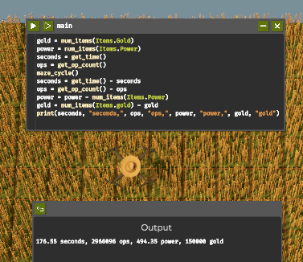

# TheFarmerSolvedAMaze
Farm gold in the game The Farmer Was Replaced

If the drone detects a maze already present it will map the existing maze using the Tremaux algorithm. This algorithm is chosen because it can handle cycles created by walls being removed during the partially completed cycle. It will then attempt to complete the cycle using the resources it already has.

If the drone does not detect a pre-existing maze, then it will attempt to farm enough pumpkins to trade for fertilizer, plant a bush on tilled soil, water it, and grow a maze. Since the game always generates a simply-connected maze, the drone will proceed to map the maze using a simpler, slightly faster hand-on-wall algorithm.

After the map is finished, navigation is done using the A* algorithm.

While following the path, any known walls for each cell are tested again. The drone will still revert to following the previously generated path after testing the walls of each cell it passes through, which is probably good enough, as it probably had a pretty good quality path already. It is not worth running the A* algorithm again after every change in the map. The updated map will be taken advantage of on the next iteration.

Before starting, the drone will attempt to farm enough pumpkins to trade enough fertilizer for the whole cycle. You should probably fill in the `farm_pumpkins` function in the main.py file.

